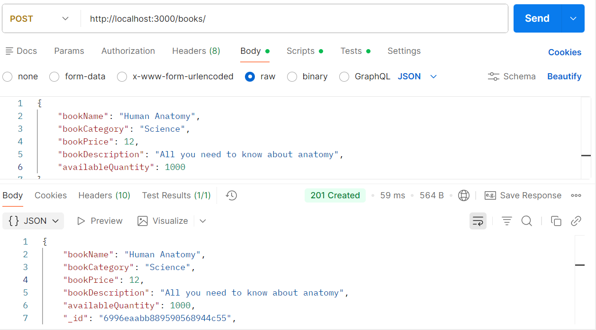
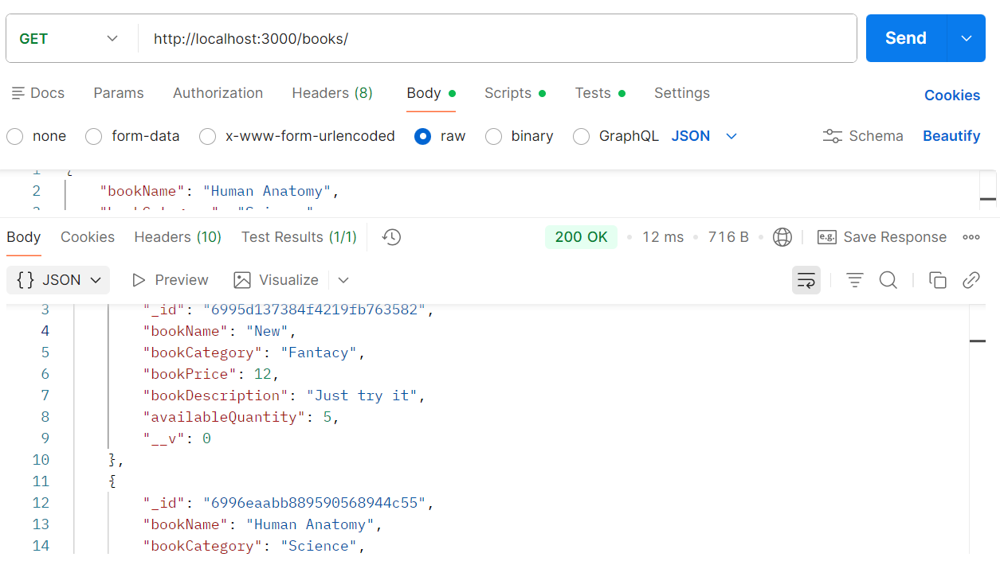
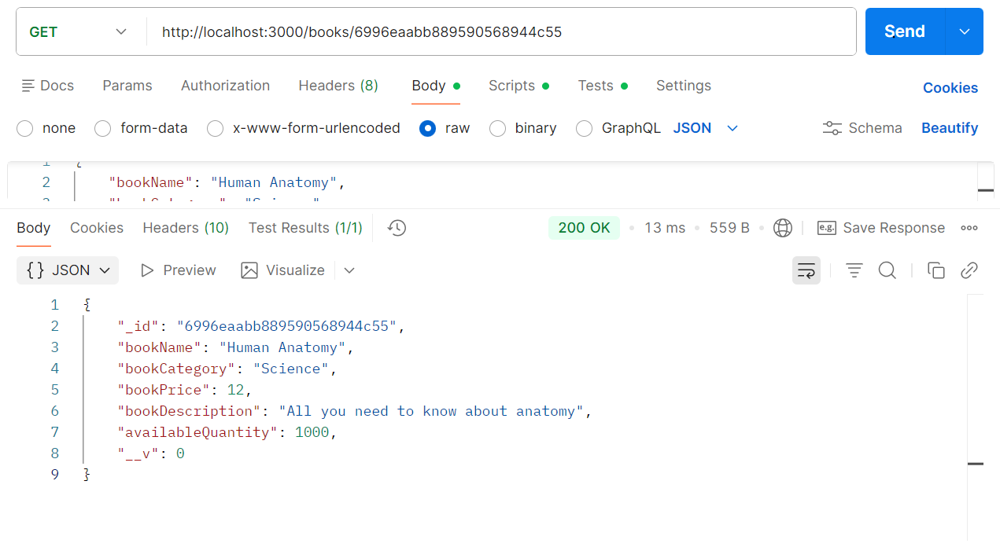

<div align="center">

# Sprint 1 Documentation

## Book RESTful API (NestJS + MongoDB)

---

*Delivering the first working increment with DevOps automation*

</div>

---

## Table of Contents

- [Sprint Goal](#sprint-goal)
- [Sprint Objectives](#sprint-objectives)
- [Expected Deliverables](#expected-deliverables-at-end-of-sprint-1)
- [Definition of Success](#definition-of-sprint-1-success)

---

## Sprint Goal

Deliver the first working increment of the Book API while establishing core DevOps practices including version control, CI/CD, and automated testing.

---

## Sprint Objectives

---

### 1. Deliver Working Software

Complete and deliver at least **two backlog items** planned during Sprint 0.

**Planned backlog items:**

<table>
<tr>
<th width="40%">Feature</th>
<th width="30%">Endpoint</th>
<th width="30%">HTTP Method</th>
</tr>
<tr>
<td>Create Book</td>
<td><code>POST /books</code></td>
<td>POST</td>
</tr>
<tr>
<td>Get All Books</td>
<td><code>GET /books</code></td>
<td>GET</td>
</tr>
<tr>
<td>Get Book By ID</td>
<td><code>GET /books/:id</code></td>
<td>GET</td>
</tr>
</table>

**Success Criteria:**

<table>
<tr>
<td width="33%">

Endpoints work correctly

</td>
<td width="33%">

Data persists in MongoDB

</td>
<td width="33%">

API responses follow RESTful standards

</td>
</tr>
</table>

---

### 2. Use Version Control (Git)

The repository must show **iterative and incremental development**.

**Requirements:**

<table>
<tr>
<td width="33%">

Each feature developed in its own branch

</td>
<td width="33%">

Small, meaningful commits

</td>
<td width="33%">

No single "big-bang" commit

</td>
</tr>
</table>

**Recommended commit prefixes:**

<table>
<tr>
<th width="20%">Prefix</th>
<th width="80%">Purpose</th>
</tr>
<tr>
<td><code>feat:</code></td>
<td>New feature</td>
</tr>
<tr>
<td><code>fix:</code></td>
<td>Bug fix</td>
</tr>
<tr>
<td><code>chore:</code></td>
<td>Setup/config</td>
</tr>
<tr>
<td><code>test:</code></td>
<td>Tests added</td>
</tr>
<tr>
<td><code>docs:</code></td>
<td>Documentation updates</td>
</tr>
</table>

---

### 3. Set Up CI/CD Pipeline

Implement a basic Continuous Integration pipeline using GitHub Actions.

**Pipeline should:**

<table>
<tr>
<td width="33%">

Install dependencies

</td>
<td width="33%">

Build the NestJS project

</td>
<td width="33%">

Run tests automatically on push or pull request

</td>
</tr>
</table>

**Expected file:**

```
.github/workflows/main.yml
```

---

### 4. Implement Testing

Add automated tests that run inside the CI pipeline.

**Testing scope:**

<table>
<tr>
<td width="50%">

Unit tests for services

</td>
<td width="50%">

OR

Integration tests for endpoints

</td>
</tr>
</table>

**Success Criteria:**

<table>
<tr>
<td width="50%">

Tests execute successfully in CI

</td>
<td width="50%">

Failed tests should fail the pipeline

</td>
</tr>
</table>

---

### 5. Sprint Review

Produce evidence showing what was delivered.

**Artifacts:**

<table>
<tr>
<td width="63%">

Screenshots of working endpoints (Postman)



</td>
<td width="33%">

Creates a new book

</td>
</tr>
</table>

<table>
<tr>
<td width="63%">



</td>
<td width="33%">

Returns all the books in the database

</td>
</tr>
</table>

<table>
<tr>
<td width="63%">



</td>
<td width="33%">

Returns a book with the specified id

</td>
</tr>
</table>

---

### 6. Sprint Retrospective

Write a reflection identifying **at least two improvements** for Sprint 2.

**Reflection should cover:**

<table>
<tr>
<th width="33%">What went well</th>
<th width="33%">What challenges occurred</th>
<th width="33%">What will be improved next sprint</th>
</tr>
<tr>
<td>

Identify successes and strengths

</td>
<td>

Document obstacles and difficulties

</td>
<td>

Plan specific improvements

</td>
</tr>
</table>

**Example Improvements:**

<table>
<tr>
<td width="33%">

Improve commit consistency

</td>
<td width="33%">

Add validation earlier

</td>
<td width="33%">

Improve testing coverage

</td>
</tr>
</table>

---

## Expected Deliverables at End of Sprint 1

<table>
<tr>
<th width="30%">Category</th>
<th width="70%">Deliverable</th>
</tr>
<tr>
<td><strong>Working Software</strong></td>
<td>Working Book API (minimum two features)</td>
</tr>
<tr>
<td><strong>Version Control</strong></td>
<td>Clean Git commit history</td>
</tr>
<tr>
<td><strong>CI/CD</strong></td>
<td>CI pipeline configuration</td>
</tr>
<tr>
<td><strong>Testing</strong></td>
<td>Automated tests</td>
</tr>
<tr>
<td><strong>Documentation</strong></td>
<td>Sprint Review documentation</td>
</tr>
<tr>
<td><strong>Reflection</strong></td>
<td>Sprint Retrospective reflection</td>
</tr>
</table>

---

## Definition of Sprint 1 Success

Sprint 1 is successful when:

<table>
<tr>
<td width="50%">

**Technical Delivery**

• Working software is delivered  
• DevOps automation is established

</td>
<td width="50%">

**Process Excellence**

• Development process follows Agile practices  
• Evidence exists for review and assessment

</td>
</tr>
</table>

---

<div align="center">

*Sprint 1 Documentation — Book RESTful API*

**NestJS • MongoDB • GitHub Actions • Agile Methodology**

</div>